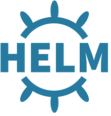

# WorkBook 
> working examples of tech stacks I have experience with

[](https://travis-ci.org/suryaval/workbook)


## Cloud Formation
Sample CF templates to spin up a LAMP stack application. - AWS Dev Preparation

## GoCD
GoCD is an opensource CI/CD tool.
Custom scripts to address build and release challenges.

## Apache Kafka
The following steps are to 
1. install Apache Kafka
2. create a sample topic 
3. push messages to a topic aka. producer
4. read messages from a topic aka. consumer
5. (Optional) Install Kafka tool to configure a cluster, monitor the messages inside the topics.

## Python Flask Restful API
Python Flask API to GET info about the current status of EC2 instances.
> Available as ready to be deployable Docker container: https://hub.docker.com/r/surval/aws-ec2-describe/

> Available to be deployed on Pivotal Cloud Foundry: https://hub.docker.com/r/surval/cf-flask-app/

## Activate Pyenv

```
virtualenv -p /usr/bin/python venv
Running virtualenv with interpreter /usr/bin/python2.7
New python executable in /Users/suryaval/workspace/journeyman/venv/bin/python
Installing setuptools, pip, wheel...done.
source venv/bin/activate
```

## HELM


