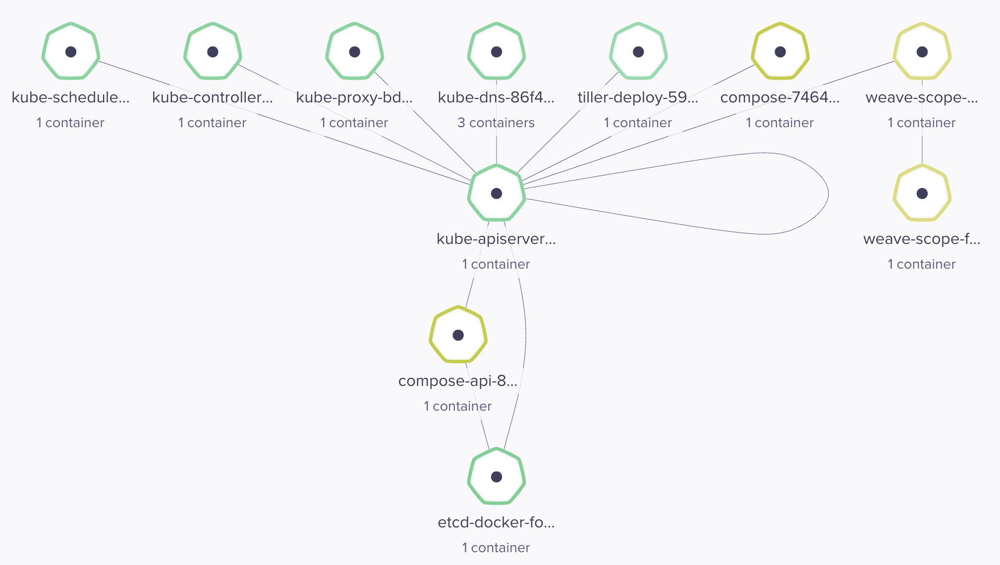

# WeaveScope

## Visualization tool to control & command pods, networks on k8s

### Installing WeaveScope

[Install WeaveScope with Helm](https://github.com/suryaval/workbook/blob/master/helm/README.md)

### Port Forward on K8s

```
kubectl -n default port-forward $(kubectl -n default get endpoints \
my-weavescope-weave-scope -o jsonpath='{.subsets[0].addresses[0].targetRef.name}') 8080:4040

Forwarding from 127.0.0.1:8080 -> 4040
Forwarding from [::1]:8080 -> 4040

Handling connection for 8080
Handling connection for 8080
```


